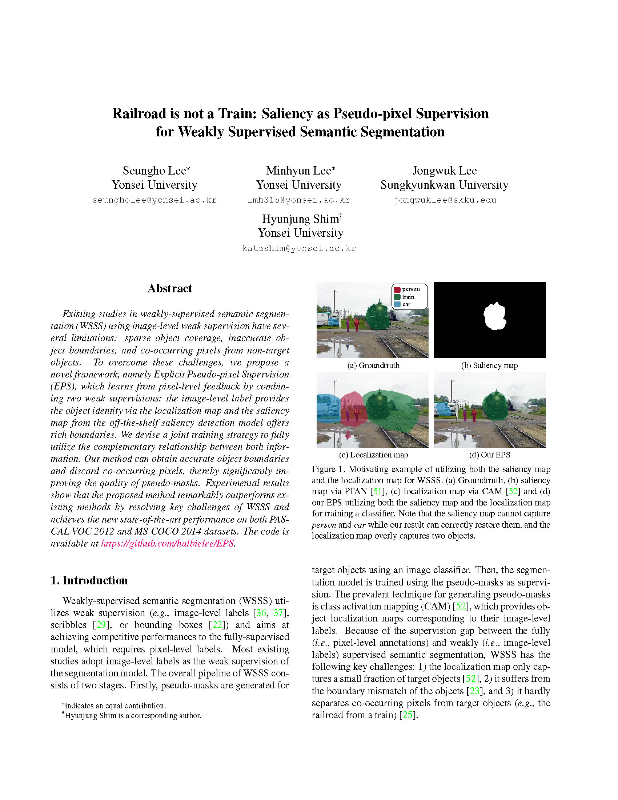
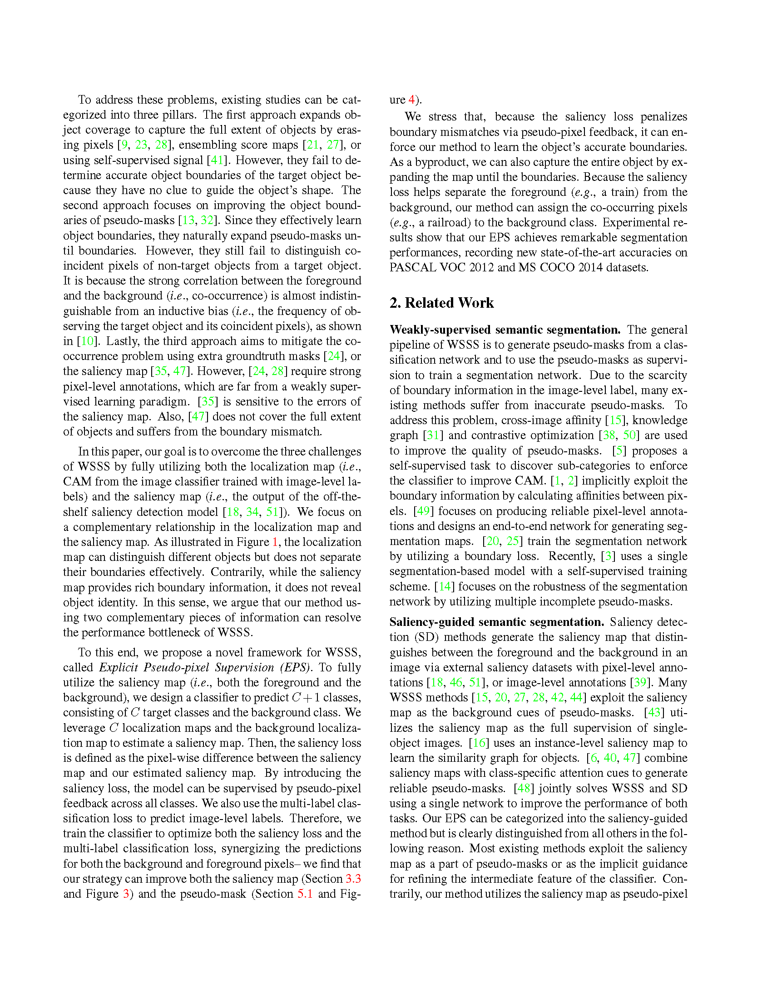
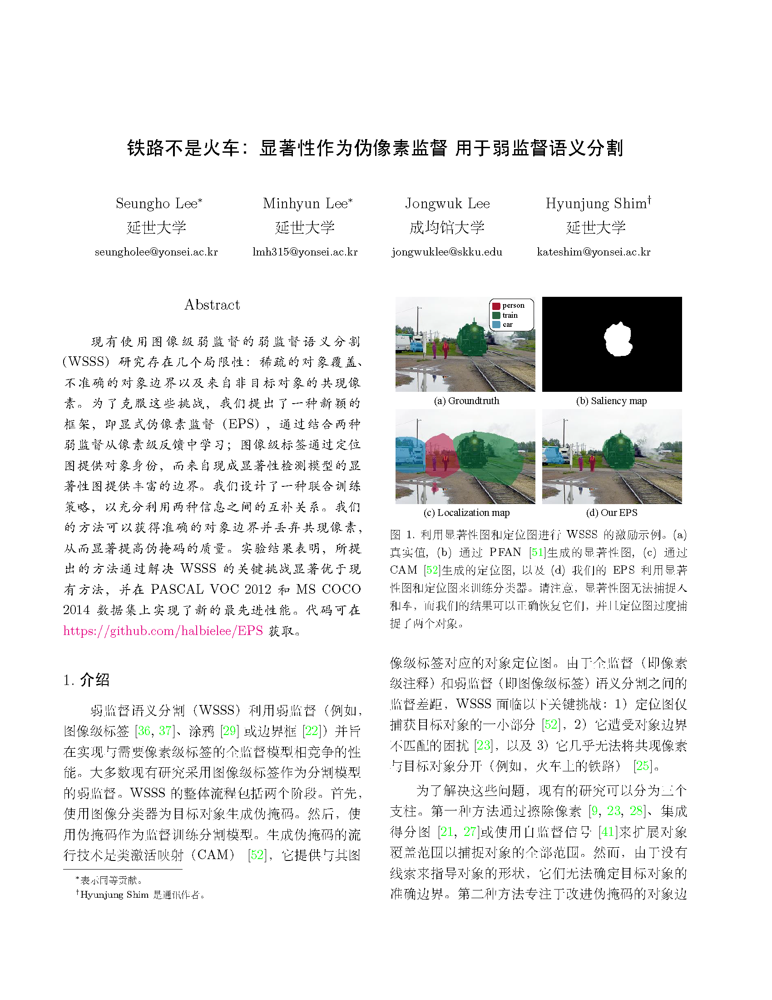
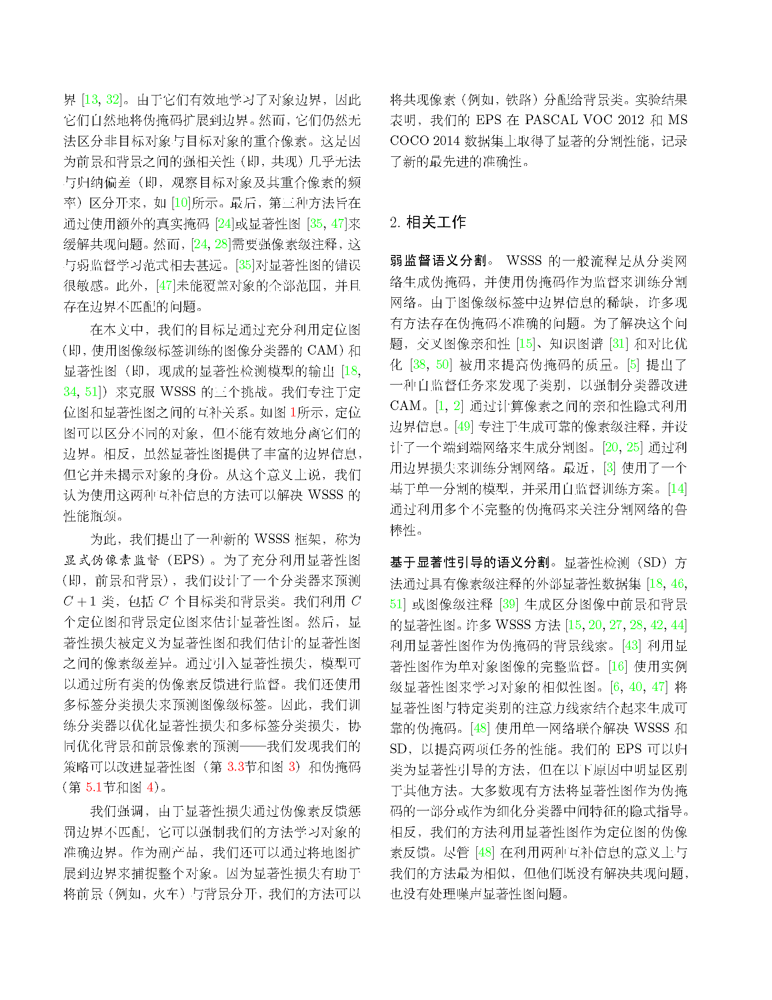

[English](README_en.md)

# tex_translator
用于批量翻译 `.tex` 文件中的自然语言内容，支持通过 OpenAI API 进行翻译，并保留 LaTeX
语法、命令、符号和格式。

### 功能概述

1. **支持批量翻译**：可以指定一个包含多个 `.tex` 文件的文件夹，并批量翻译其中的文件内容。
2. **翻译控制**：用户可以自定义翻译的目标语言、翻译模型、温度、翻译分组长度等参数。
5. **翻译结果**：翻译结果会保存在一个新目录中，文件目录结构与原始文件夹保持一致。

### 安装和运行

1. 克隆此仓库：

   ```bash
   git clone https://github.com/wilinz/tex_translator.git
   cd tex_translator
   ```

2. 安装依赖：

   ```bash
   dart pub get
   ```

3. 运行程序：

   ```bash
   dart run bin/tex_translator.dart --source <源文件夹路径> --apikey <OpenAI API密钥> --target <目标语言> [其他选项]
   ```

### 参数说明

| 参数               | 缩写      | 说明                                  | 默认值                      |
|------------------|---------|-------------------------------------|--------------------------|
| `--source`       | `-s`    | `.tex` 文件所在的根文件夹路径                  | 必填                       |
| `--apikey`       | `-k`    | OpenAI API 密钥                       | 必填                       |
| `--baseurl`      | `-b`    | OpenAI API Base URL                 | `https://api.openai.com` |
| `--target`       | `-t`    | 目标语言（例如：zh-CN, ja-JP）               | ``                       |
| `--output`       | `-o`    | 翻译后文件的输出目录，默认为 `<文件夹名称>_translated` |                          |
| `--model`        | `-m`    | OpenAI 模型（例如：gpt-4o）                | `gpt-4o`                 |
| `--temperature`  | `-temp` | 控制翻译的随机性（0.0-1.0）                   | `0`                      |
| `--group-length` | `-gl`   | 翻译分组的最大字符数                          | `5000`                   |
| `--force`        | `-f`    | 强制从头开始翻译（忽略进度文件）                    | `false`                  |
| `--help`         | `-h`    | 显示帮助信息                              |                          |

### 示例

1. 基本使用：

   ```bash
   dart run bin/tex_translator.dart --source ./tex_files --apikey YOUR_OPENAI_API_KEY --target zh-CN
   ```

2. 强制重新开始翻译：

   ```bash
   dart run bin/tex_translator.dart --source ./tex_files --apikey YOUR_OPENAI_API_KEY --target zh-CN --force
   ```
翻译效果：
原文：

翻译后：
### 许可

本项目使用 MIT 许可证，详情请参见 [LICENSE](LICENSE)。