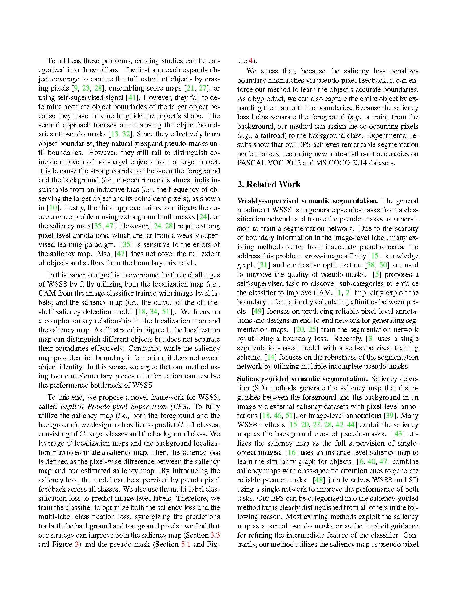

[中文](README.md)

# tex_translator

This project is designed for batch translation of natural language content in `.tex` files, supporting translation via the OpenAI API while preserving LaTeX syntax, commands, symbols, and formatting.

### Feature Overview

1. **Batch Translation Support**: Allows you to specify a folder containing multiple `.tex` files and translate their contents in bulk.
2. **Translation Control**: Users can customize parameters like target language, translation model, temperature, and translation group length.
3. **Translation Results**: The translation results will be saved in a new directory, with the folder structure matching the original folder.

### Installation and Execution

1. Clone this repository:

   ```bash
   git clone https://github.com/wilinz/tex_translator.git
   cd tex_translator
   ```

2. Install dependencies:

   ```bash
   dart pub get
   ```

3. Run the program:

   ```bash
   dart run bin/tex_translator.dart --source <source folder path> --apikey <OpenAI API key> --target <target language> [other options]
   ```

### Parameter Explanation

| Parameter        | Abbreviation | Description                                                                  | Default Value            |
| ---------------- | ------------ | ---------------------------------------------------------------------------- | ------------------------ |
| `--source`       | `-s`         | Path to the root folder containing `.tex` files                              | Required                 |
| `--apikey`       | `-k`         | OpenAI API key                                                               | Required                 |
| `--baseurl`      | `-b`         | OpenAI API Base URL                                                          | `https://api.openai.com` |
| `--target`       | `-t`         | Target language (e.g., zh-CN, ja-JP)                                         | \`\` (empty)             |
| `--output`       | `-o`         | Output directory for translated files, default is `<folder_name>_translated` |                          |
| `--model`        | `-m`         | OpenAI model (e.g., gpt-4o)                                                  | `gpt-4o`                 |
| `--temperature`  | `-temp`      | Controls the randomness of the translation (0.0-1.0)                         | `0`                      |
| `--group-length` | `-gl`        | Maximum character count for translation groups                               | `5000`                   |
| `--force`        | `-f`         | Force translation to start from the beginning (ignore progress file)         | `false`                  |
| `--help`         | `-h`         | Show help information                                                        |                          |

### Example

1. Basic Usage:

   ```bash
   dart run bin/tex_translator.dart --source ./tex_files --apikey YOUR_OPENAI_API_KEY --target zh-CN
   ```

2. Force restart the translation:

   ```bash
   dart run bin/tex_translator.dart --source ./tex_files --apikey YOUR_OPENAI_API_KEY --target zh-CN --force
   ```

Translation Results:
Original Text:

Translated Text:


### License

This project is licensed under the MIT License. See the [LICENSE](LICENSE) file for details.